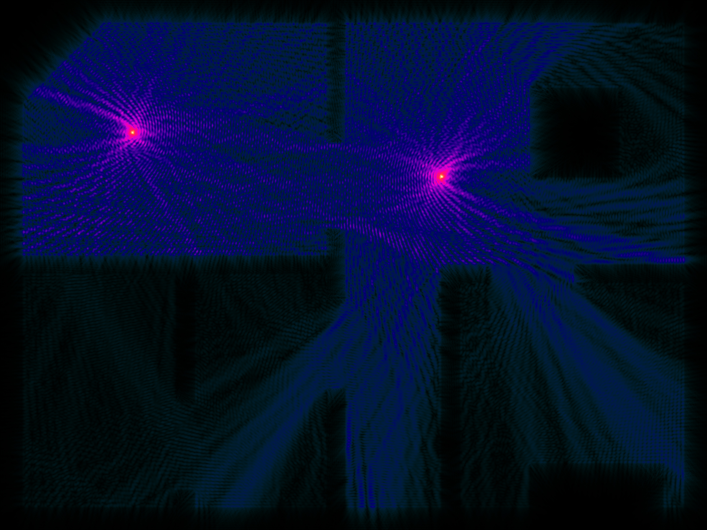

# WiFi Signal Propagation Simulator using the Finite Element Method (FEM)

This project is an engineering thesis focused on simulating WiFi signal strength in indoor environments using the **finite element method** (FEM). It provides a C++ API and graphical interface for generating custom 2D apartment layouts and visualizing signal distribution using OpenGL.

# Preview





# Setup

to install OpenGL for plotting on Linux

```sudo apt-get install libglfw3-dev```

also install Eigen library, might be needed to change header in main.cpp

```#include <eigen3/Eigen/Eigenvalues>```

to the location of Eigen

run the preview program

```
mkdir -p build
cd build
cmake ..
make
./MES
```

